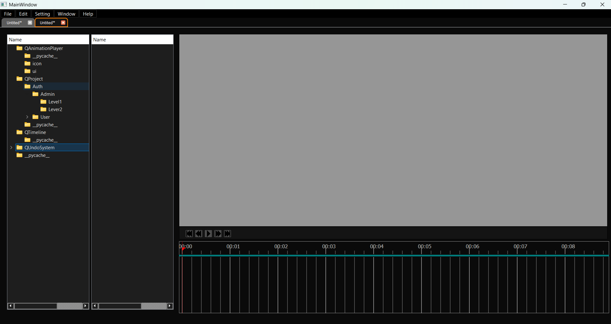

# QAnimator - Ứng dụng hỗ trợ tạo animation để làm game
* App hơi phức tạp nên cho AI viết README nhé :))

A PyQt5-based animation toolkit for creating and managing sprite animations.

## Overview

QAnimator is a powerful and user-friendly animation editing tool designed for working with sprite-based animations. It provides a familiar timeline-based interface similar to professional animation software but specialized for sprite sheet animations commonly used in games and interactive applications.

## Features

- **Sprite Animation Player**: Load sprite sheets and play animations with customizable frame rates
- **Timeline Editor**: Intuitive timeline interface for precise control over animation timing
- **Keyframe System**: Add, move, and delete keyframes for animation control points
- **Project Management**: Organize and manage multiple animation projects
- **Undo System**: Full undo/redo functionality for all operations

## Components

The application consists of several custom Qt widgets:

- **QTimeline**: A timeline widget for visualizing and editing animation frames and keyframes
- **QAnimationPlayer**: A player widget for previewing sprite animations
- **QProject**: A project management widget for organizing animation assets
- **QUndoSystem**: An undo/redo system for tracking and reversing changes

## Getting Started

### Prerequisites

- Python 3.9+
- PyQt5

### Installation

1. Clone the repository:
   ```
   git clone https://github.com/yourusername/QAnimator.git
   cd QAnimator
   ```

2. Install dependencies:
   ```
   pip install -r requirements.txt
   ```

### Running the Application

Launch the application by running:

```
python animation.py
```

## Usage

### Loading a Sprite Sheet

1. Open the application
2. Create a new tab using File > New or the toolbar button
3. Load a sprite sheet by using the QAnimationPlayer's load function
4. Specify the width and height of each sprite in the sheet

### Timeline Controls

- **Adding Keyframes**: Right-click on the timeline at the desired position
- **Moving Keyframes**: Select and drag keyframes to adjust timing
- **Multiple Selection**: Use right-click drag to select multiple keyframes at once
- **Playback**: Use the player controls to play, pause, and navigate the animation
- **Zooming**: Use the mouse wheel to zoom in/out of the timeline

## Project Structure

- `animation.py`: Main application entry point
- `main.py`: Alternative simplified entry point
- `QHWidgets/`: Contains all the custom widget components
  - `QTimeline/`: Timeline editor widget
  - `QAnimationPlayer/`: Sprite animation player
  - `QProject/`: Project management widget
  - `QUndoSystem/`: Undo/redo functionality
## Acknowledgements

- PyQt5 for providing the GUI framework

## Demo


